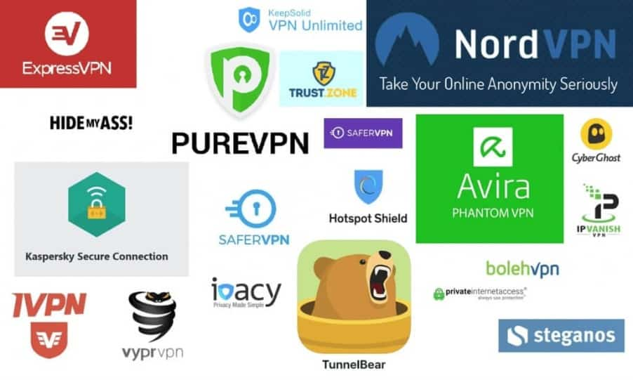
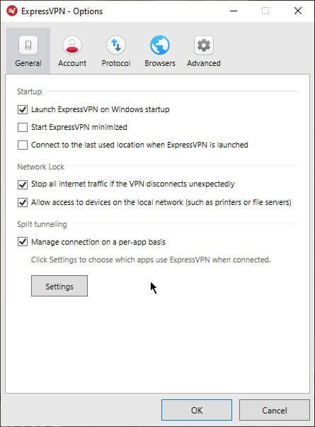
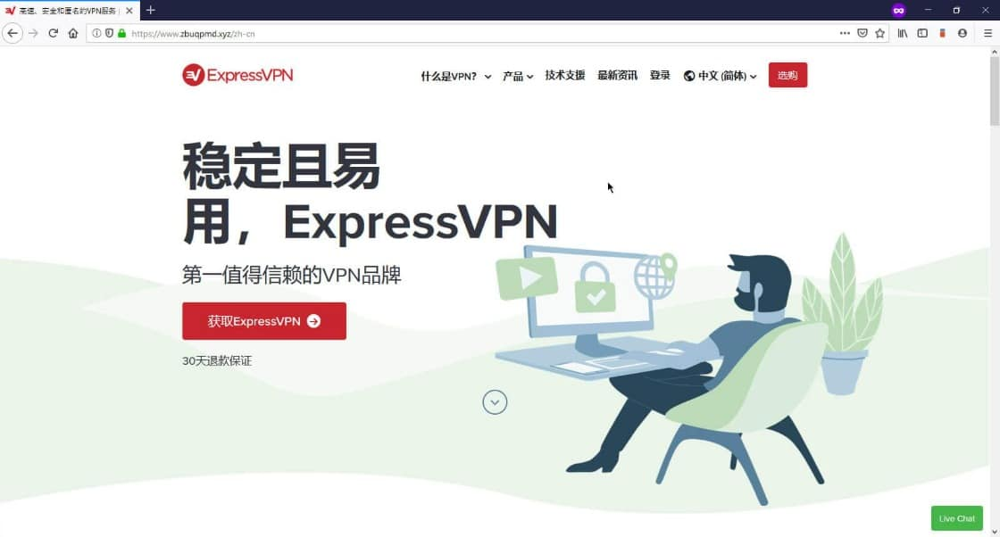
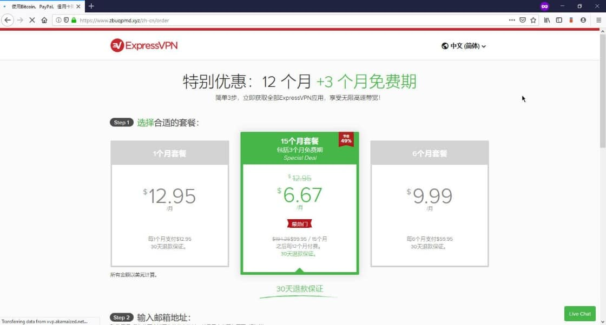
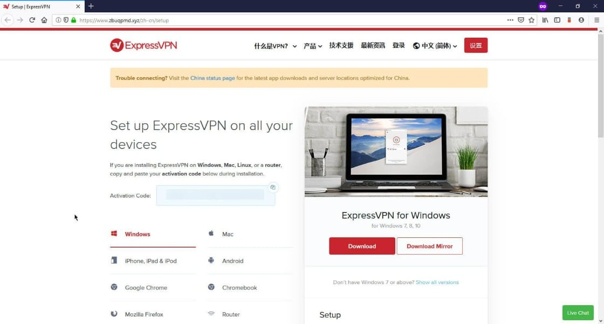
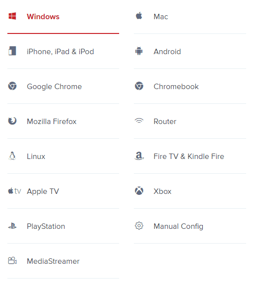
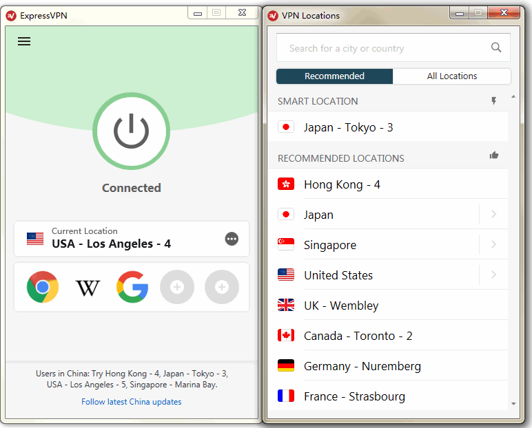
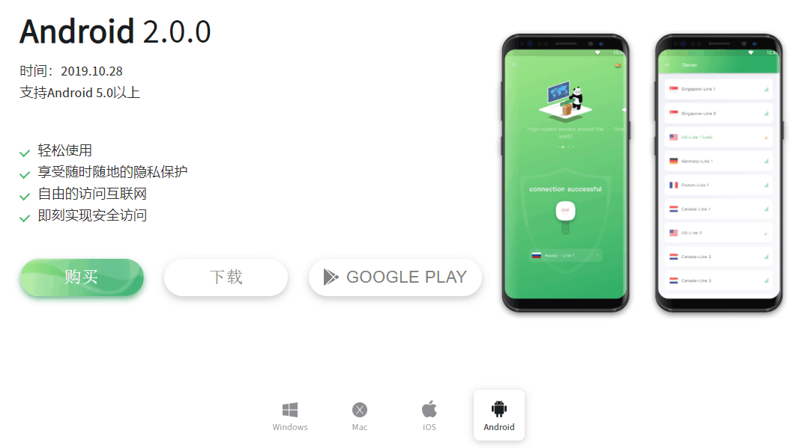
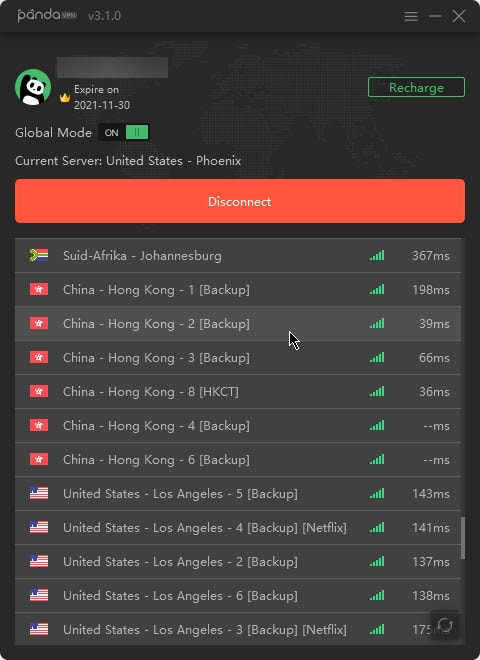
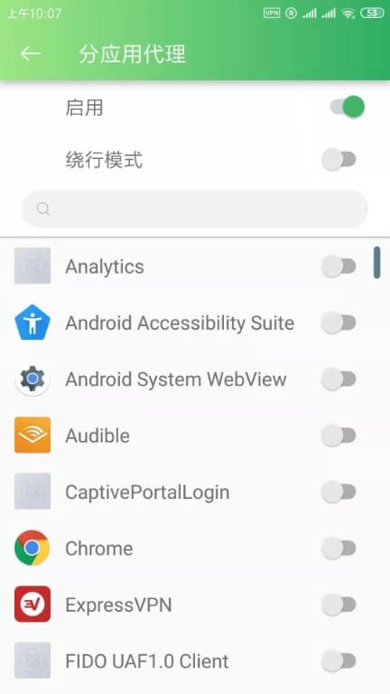

# 翻墙软件指南，中国VPN推荐-2020版

最后修改于： `2020年7月5日`

## 翻墙软件现状

市场上翻墙软件多如牛毛，如果你经常关注这个行业，能找到几十上百款App，一点也不夸张。科学上网一如既往，八仙过海，各显神通。但千万别以为找到中国能用的翻墙软件很容易，事实上一点也不，真的能在中国大陆使用的翻墙工具凤毛麟角。为什么会这样？我们当然知道这是因为墙很高，一年比一年高，这是事实。但具体到底是为什么如此饱和的VPN软件市场，也难找到几款中国能用的产品？

>如果你不想听我接下来的啰嗦，**我建议直接选择<a rel="nofollow noopener" href="https://linkv.org/express-zh" target="_blank">ExpressVPN</a>，在国内使用体验最好，我自己也常年使用，它已经运营了12年（至2020年），设备支持最全面，国内外口碑都很好**，是我个人最喜欢的VPN软件，国内有大量活跃用户，你可能不是第一次听到它，几乎所有国内外VPN推荐网站它都排在最靠前的位置。这里还有个ExpressVPN使用小提示，万一在敏感时期VPN服务器暂时被墙之后，改变客户端默认的连接协议（一般是`Automatic`），**改为`L2TP-IPSec`协议**然后尝试连接，你会发现其实还有些节点可以正常连接使用。

为什么VPN软件市场难以找到几款中国能用的产品？我想主要还是因为大部分VPN商家没有抗衡防火长城的资金和技术，翻墙软件商家的焦灼在于：要维持对中国大陆用户的服务，必须有持续投入到算法更新，服务器更新，镜像站维护的财力。在和网络防火墙长期猫捉老鼠的斗争中，95%以上的服务商最终不得不败下阵来。

根据我自己有限的翻墙经验，现在适合中国的VPN加起来恐怕连15款都不到，或者我说得过于乐观了，也许连10款都不到，因为不排除我没测试过的。但别气馁，好消息是，尽管每天都有众多翻墙软件失效，每天也有很多翻墙工具上线，不过**也要警惕一些国产的小型或者私人服务商，不仅随时可能被封跑路，而且用户的隐私信息安全也不能得到保障**。而且，重视中国市场的服务商们，一直孜孜不倦地改进着算法，每天增加着更多的服务器，每隔几周都换掉镜像域名，为的就是你能访问到真正的国际互联网、他们能获利，达成双赢。

>墙很高，会越来越高，但它也没那么高，高到把天地都分开。

我写本篇，是为了帮你找到中国好用的翻墙软件，我只能尽我所能地测试。因为翻墙软件能否有比较好的使用体验，除了取决于厂商、产品等因素外，还有无法预测的变量，比如上网时段、网络接入商当时的审查口径、用户自己的上网环境和设备等，所以请读者关注本文头部的“`最后修改于`“时间，我会一直尽可能地给大家最新最准确的讯息。

> ## 本文内容导航
> ### 1. [翻墙软件现状](#翻墙软件现状)
> ### 2. [什么VPN适合中国用户?](#什么vpn适合中国用户)
> ### 3. [怎么下载和登录vpn客户端?](#怎么下载和登录vpn客户端)
> ### 4. [翻墙VPN功能&价格对比表](#翻墙vpn功能价格对比表)
>### 5. [不要在这些VPN上浪费时间](#不要在这些vpn上浪费时间)
>### 6.[怎么下载和登录VPN客户端?](#怎么下载和登录vpn客户端)
>### 7. [适合在中国使用的VPN推荐](#适合在中国使用的vpn推荐)
>>#### 7.1 [ExpressVPN](#1expressvpn)
>>#### 7.2 [NordVPN](#2-nordvpn)
>>#### 7.3 [PandaVPN](#3panda熊猫vpn)
>>#### 7.4 [IVacy](#4-ivacy)
>
>### 8.[中国VPN问答](#中国vpn问答)
>>#### 8.1 [为什么要小心免费VPN？](#为什么要小心免费vpn)
>>#### 8.2 [如果不是为了翻墙，VPN还有用吗？](#如果不是为了翻墙vpn还有用吗)
>>#### 8.3 [为什么自建的OpenVPN无法翻墙，或者很快被墙？](#为什么你自己架设的openvpn无法翻墙或者很快被墙)

## 什么VPN适合中国用户？

### 在中国能用
任凭技术吹说得多牛逼，速度如何如何快，加密算法如何如何强大，客户端如何如何简洁，客服如何如何亲切， 价格如何如何优惠，如果一个VPN在中国连接不了、翻不了墙，再吹也没用。

能用的标准是客户端下载下来安装，能在未来一年的绝大多数时间（90%以上）你都可以正常连接，不影响上网。不管是一个总能连上的节点，还是多个时不时要切换的节点，必须得连得上，连不上就什么都等于零。不止能连上，还能保持稳定在线，速度也要有保证，如果隔一会儿就掉线、网页打开都费劲，那还真不如不用。

为了对中国能用的VPN做到尽量准确评价，我都会买上至少一个月的使用期，有的VPN很好测，装好就能稳定连上，测试起来很省力。有的就不是，往往要做点配置，或者试多几个服务器才能连上。但我测试的绝大多数的VPN是根本用不了的，我一般测个几天后也就死心了。能用的我会续费使用，观察长期的总体表现。

测VPN花的钱并不多，我平时工作、出差需要翻墙就顺带连接测试一下，我也没打算把市场上的产品都测一遍，那我只能天天吃泡面了，我也不可能有那个精力，这没啥技术含量但是是个体力活，就是注册购买装好客户端，把功能试一遍，把适合中国的香港、日本、美国、新加坡等节点都试连一遍。

我实测了一些业界知名的VPN，本文推荐的VPN产品基于价格、网络速度以及使用体验等指标，以确保得到在国内真实的使用情况。并且提供了每家VPN近期的优惠折扣，以及价格信息，希望能为大家在选择VPN的时候作为有效的参考。这几家VPN都有30天内不满意退款保证（Panda为7天），如果使用过程中出现问题，可以及时联系客服解决或者退款。本文会定期更新适合在中国使用的VPN名单，请收藏本文,以便查看。

### 购买与下载方便

如果能支持支付宝、微信或者银联借记卡付款就更方便，信用卡还是不太方便。我尽量推荐能从国内访问且直接购买的VPN产品，如果能支持支持支付宝付款和银联就最好，其实一般重视中国市场的商家，所以都会支持支付宝。

### 速度快

我翻墙的主要应用就几个：看油管，看Netflix，用Google，偶尔用Facebook，Twitter，用Google的时候会访问各种国外技术类网站（我是学计算机的，正走上码农这条万劫不复的道路），其它可以忽略不计。

油管是用来学习的，大量技术资源，我觉得是目前最好的免费学习平台，我用油管之频繁，恐怕用它直接视频搜索的使用量已经超过了Google搜索量。看油管需要速度，视频越来越清晰，540P，720P，1080P，基本也遵循摩尔定律，对VPN速度的要求也越来越高。Netflix是我用来消遣的主要应用，追美剧看电影，每晚在美剧的喧闹聒噪里进入梦乡。如果VPN速度不给力，角色笑两声停一停，我恐怕会夜夜失眠。

### 安全可靠

我自己买VPN的主要目的就是翻墙，我相信绝大多数中国网民和我一样。当然希望使用的工具尽量安全可靠，不泄露我的上网信息。你在中国大陆使用VPN就像进入了一个屋子，运营商知道你在这个屋子里面，但不知道你在屋子里面干嘛，当然国产的VPN和小型的翻墙软件不在此列，事实上因为没有行业监管，很多国产的VPN和小型的翻墙软件会记录用户的log活动信息和隐私信息，以便利益最大化或者以备审查，最有名的事件是前几年GreenVPN被关停，然后把用户的上网记录交给相关部门审查。

我说的安全可靠，是指一些不要有敏感个人信息的泄露，比如上网时用到的帐号密码与支付等信息，技术上说，VPN即是一座桥，也是一个岗哨，如果厂商决定要强制你登记，或者偷偷记下你的流量信息，就有潜在的风险，只是我们都很忙，没有时间来仔细思考这种风险有多大。但事实是网络安全和数据泄露事件发生的频率正在逐年升高，我们不知道不等于网络很安全。强加密是基础，整个VPN协议都建立在加密基础上，但加密是不够的，还要充分尊重用户隐私才行。

可靠性的另一个方面是VPN提供商的背景。公司注册在中国大陆的提供商，政府要关停它很容易，我不推荐。从2017年GreenVPN被关停开始，大批国内VPN提供商被关停，给用户带来不便和损失，目前也出现不少山寨的玩意，很多不超过2个月就跑路换马甲继续坑人。

其实VPN最开始不是用来翻墙的，VPN始于国外，在国外是一个正规的IT产业，需求对象是公司的机密通信和注重信息安全的个人，它的核心任务是保障用户的数据安全，国内用户使用它翻墙只是近年来衍生出的次要任务。国外的VPN公司都是吃保护用户隐私信息这碗饭的，只是顺便帮助咱们翻墙，所以说真正的保护用户隐私的VPN都是国外的大品牌，很多都会请第三方审计机构进行零log认证。

## 怎么下载和登录VPN客户端？

### Windows和MacBook电脑客户端

注册购买后，直接登录用户后台“`My Account`”页面，找到与你的操作系统对应的安装包，直接下载安装就OK了。

登录方式不同品牌有一些不同：

比如ExpressVPN直接在客户端登录页面填入注册码就行了，最为方便，注册码在用户后台页面一眼就能找到；

StrongVPN、PandaVPN、NordVPN都是下载安装客户端后，输入注册时的邮箱密码登陆就行了。

### 安卓Android手机客户端

大体和电脑端一样，直接可以在官网下载pkg的安装包进行安装，唯一不同的是也可以在“Google Play”上进行安装。

### iOS系统（包含iPhone和iPad）客户端

由于中国区`APP Store`的VPN软件全部下架，只能用国外的Apple ID。获得国外的Apple ID有两种办法：

#### 1.联系在线客服获取
打开官网，一般在右下角能找到在线聊天框，在注册后打开聊天框，找客服索取Apple ID，一般都会提供。由于语言不同，在线聊天一般用英文，**英语不行的找谷歌翻译或百度翻译**，也可以直接复制下面的句子（把XX换成具体品牌）：

Hi,I live in China,and I can't download *XX* VPN on my iPhone because it was not existed in App Store.Can you offer me an Apple ID so I can download and install ?

#### 2.淘宝购买
去淘宝花几块钱买个美国ID也很方便，自己注册可能会遇到一些问题，淘宝搜索“美国 ID”就行了，10块钱以内，不要买贵了！
得到ID之后，进入`APP Store`，点击右上角退出现有账号，然后重新登陆，**不是iCloud，iCloud账号不要动！**

>注意：现在淘宝不让卖Apple ID，卖家会弄一些擦边球的字眼，几块钱的那些商品其实也是卖ID的，进店咨询就行了。

这是我觉得目前最适合在中国使用的几款翻墙软件，这几款翻墙VPN，都经过我长期的使用和测试，对防火长城封锁的应对最快，能比较快速地进行软件客户端和服务器节点的更新，能满足国内用户长期使用的需求。另外，该文章会不断更新，请收藏本页面以便以后查看。

## 翻墙VPN功能&价格对比表

项目 | 1.ExpressVPN | 2.NordVPN | 3.PandaVPN | 4.Ivacy 
------------ | ------------- | ------------- | ------------ | ------------
综合评分（10分制） | 9.7  | 9.3 | 9.0 | 9.2 
价格 | 较高 | 一般 | 一般 | 较低 
运营时间 | 长  | 长 | 短 | 长 
全年可用率（估计） | 97%  | 95% | 90% | 90% 
可用节点数量 | 中 | 中 | 中 | 中 
连通率 | 高  | 中高 | 中 | 中 
建立连接时间 | 快  | 快 | 快 | 快 
连接稳定性（相对）| 稳定 | 稳定  | 一般 | 稳定 
传输速度 | 很快  | 快 | 一般 | 一般 
隐私安全 | 高  | 高 | 低 | 高 
APP支持 | 全  | 全 | 全（不支持路由器） | 全 
支付宝 | 支持  | 支持 | 支持 | 支持 
退款时限 | 30天内  | 30天内 | 7天 | 30天内 
售后服务 | 好  | 好 | 一般 | 一般 
镜像官网 | 有  | 无([如何访问?](#如何打开nordvpn官网)) | 有 | 无([如何访问?](#如何打开ivacy官网)) 
APP快速下载 | 可以  | 可以 | 可以 | 可以 
优惠 | [年付送3个月](https://linkv.org/express-zh)  | [最多优惠75%](#如何打开nordvpn官网) | [年付优惠](https://linkv.org/panda) | [年套餐优惠86%](#如何打开ivacy官网)

关于具体套餐的选择，如果VPN商家的运营时间短，比如PandaVPN，建议只买一个月的套餐，根据使用体验再考虑是否续费，因为服务还没有经过长时间的检验。如果VPN商家的运营时间长（5年以上），长期可用性一般问题不大，选择一个月或年套餐都可以，年套餐每月便宜很多。

如果你不想听我啰嗦，我建议直接买<a rel="nofollow noopener" href="https://linkv.org/express-zh" target="_blank">ExpressVPN</a>，我自己也常年使用，它已经运营了12年（至2020年），设备支持最全面，国内外口碑都很好，是我个人最喜欢的VPN软件，国内有大量活跃用户，你可能不是第一次听到它，几乎所有国内外VPN推荐网站它都排在最靠前的位置。这里还有个**ExpressVPN使用小提示**，万一在敏感时期VPN服务器暂时被墙之后，改变客户端默认的连接协议（一般是`Automatic`），**改为`L2TP-IPSec`协议**然后尝试连接，你会发现其实还有些节点可以正常连接使用。

>在中国的老外，用得最多的是ExpressVPN。

NordVPN在全球范围内应该是为数不多的能和ExpressVPN抗衡的服务商之一，在中国的速度表现也非常不错，拥有军用级别的加密技术，目前三年优惠活动也比较划算。但目前客户端直连翻墙**建议连接新出的服务器**，服务器越新连通率越高，速度也快，建议连接日本、新加坡、英国、加拿大这些地区新出的服务器。学会使用OpenVPN手动配置，很简单，官网有教程，它的速度和稳定性会更高，敏感时期**配合用OpenVPN或IKEV2进行手动配置**可以保证全年95%左右的可用率。

PandaVPN的运营时间虽然不长，但也比较好用，连接速度快，提供香港/美国/台湾/日韩等多国节点，它甚至有中国大陆节点可以翻墙回国，虽然设备支持远没有ExpressVPN全，不支持Linux/路由器等其它不常用设备，隐私保护政策略显模糊，但拿来日常使用是个不错的翻墙软件。

## 不要在这些VPN上浪费时间

VyprVPN不再做推荐，稳定性已经不如以前，虽然勉强也能使用，但据一些网友反映，掉线问题没办法解决。**如果你在其他地方看到有人推荐VyprVPN，不要在入坑了。**

你可能在别的网站看到对TunnelBear，CyberGhost，Ipvanish等VPN的推荐，我都亲自试用过，的确，它们在国外很流行，本身都是不错的服务，但这些翻墙软件确实不适合在中国使用，要么是根本连不上，要么是要繁琐的手动配置才能连得上，要么是一开始能连，一段时间后完全不能用。下文陆续会有中国不能用VPN的更新，这里先提醒一下，不要在这些产品上花费时间和金钱。

## 适合在中国使用的VPN推荐

### 1.[ExpressVPN](https://linkv.org/express-zh)

`最近使用：2020年7月，确认可用，体验最佳。`

>什么都不需要说，我自己用了5年多，市场上最强跨设备通用翻墙软件。

这是中国最好用的VPN，用了5年，虽然特殊时期也碰到问题，但一年中97%的时间里使用都很流畅。ExpressVPN已经为中国网民服务了12年。 这是目前唯一一个任何人想都不用想就可以买的VPN，连通率应该是最高的，速度相比其他VPN软件也不慢，镜像网站更新最及时，隐私保护技术最好，还有最重要的，客户端最好用，设备支持它最全。

在我用的几年时间里，每年不能用的时间总共加起来大致在1个星期左右（即所谓“敏感时期”），会有几天时间出现频繁短线或者网速变得非常慢。根据我的使用体验估计ExpressVPN全年正常可用率在97%左右。在中国大陆使用ExpressVPN，建议选择连接官方推荐的VPN服务器线路，这些服务器线路是ExpressVPN官方针对中国地区做过的混淆服务器优化，推荐中国用户使用：

    Japan–Yokohama
    Hong Kong–4
    Singapore–Marina Bay
    Hong Kong–5
    USA–Los Angeles–4
    USA–Los Angeles–5
    USA–Santa Monica
    Canada - Toronto - 2
    France - Strasbourg
    Germany - Nuremberg

除了上面那些优化过的服务器线路，**中国用户也可以改为`L2TP – IPsec`协议使用其它的服务器线路**，在敏感时期网络封锁升级，你会发现，虽然官方的推荐节点连不上了，这些`L2TP – IPsec`协议的一些节点还是可以用的，但是其他那些服务器没有经过混淆算法优化，速度可能会不如官方推荐的服务器线路，可以作为敏感时期的备用节点。

#### 为什么ExpressVPN是最好用的中国VPN翻墙软件？

因为他重视中国市场。世界上的VPN软件成千上万，愿意为中国用户提供镜像站的一只手数得过来，ExpressVPN的镜像站，对中国用户始终保持着可访问。

客户端好用的VPN不少，但提供无需Google Play商店和苹果美国商店即可安装客户端的VPN厂商，恐怕ExpressVPN是仅有的几家之一。

推荐香港、日本、新加坡、美国节点，提供国内能打开的镜像站，不翻墙即可购买，真正全终端覆盖，电脑（Windows，MacOS，Linux），手机（安卓，iOS：iPhone/iPad），路由器，游戏主机（PS2，XBox）等，安卓手机无需Google Play也可安装，iOS设备无需访问苹果商店也可安装，同时5台设备，单独配置哪些应用走VPN哪些不走（Split Tunneling），30天无理由退款，支持支付宝付款，支持P2P下载，不限流量。**最多支持5台设备同时在线使用。**

ExpressVPN已通过普华永道隐私保护机制审计 —— 意思是说不像很多口是心非的不良厂商，ExpressVPN的无日志政策是实打实的无日志。

- 无硬盘服务器。

ExpressVPN是目前唯一提供无硬盘服务器的VPN厂商，技术上，这种服务器无法保留任何上网痕迹，重启或断掉所有信息都会被抹得一干二净。

- 智能连接

首先是自动检测最快的服务器，你不需要自己一个个去试，绝大多数情况下软件检测到的（Smart Location）就是当时最佳节点。其次，断线自动重连，虽然只是个小功能但真的很有用，而且每次重连时它会自动切断网络（Kill Switch），防止某些应用程序流量无意间泄露。

同时访问内外网，开VPN最让人烦恼的问题是打开国内网站会变慢，有些甚至会打不开。拆分隧道技术（Split Tunneling）让你配置哪些应用程序走VPN加密通道，哪些走本地网络流量。

- DNS泄露保护

ExpressVPN在每台服务器上运行自己的私有加密DNS服务器，一旦连上，所有上网的DNS请求都会通过这些私有的域名服务器，不走任何公网服务器，你的上网隐私得到进一步保护。

### 如何获取ExpressVPN？

获得ExpressVPN非常简单，买就行了。绝大多数国外VPN服务官网是被墙掉的，服务商懒得为中国VPN用户提供镜像站，服务再牛逼也没用，国内打不开。

只有少数几个国外VPN提供商能为中国VPN用户维护长期可访问的镜像网站，ExpressVPN是其中之一。它的官网在中国大陆已经被墙多年，如果你在国内，不先翻墙是打不开的。但是，你很可能可以打开它的镜像网站，不断有镜像站域名被墙，也不断有镜像站域名加入，这已经持续了很多年，一线的VPN厂商就是通过不断更新的镜像站域名为广大中国VPN用户提供者服务。

所以要获得ExpressVPN其实非常简单：

**第一步：打开[ExpressVPN镜像站](https://linkv.org/express-zh)**

> ExpressVPN的镜像网站除了域名和官网不同以外，其他服务和功能和官网一样的，在线客服沟通、用户账号登陆和app安装包下载都可以在镜像网站完成。而且镜像网站数据与官网实时互通，在镜像网站注册的账号也可以在官网域名和其他镜像网站使用。

注意：镜像网站打开速度有时不快，耐心等待一下，如果页面加载不正常，如排版乱掉，可以试试刷新下页面。如果镜像站链接打不开，这种情况一般是镜像网站被墙，官网一般在当天会放出新的镜像站，请收藏本文后等一段时间再打开。

**第二步：购买ExpressVPN，获得帐号**

购买ExpressVPN， 支持支付宝、Paypal和银联、Visa信用卡付款，**无论你买什么套餐，30天内都可以无条件退款**。首购买一年送3个月，是厂商限时推的活动，如果不放心，可以先买一个月（$12.95）用用看，好用后再续费，不过这时候应该就没有送3个月了，除非再通过上面的链接进入注册新帐号，当然换浏览器或清cookie啥的不用多说吧。

**第三步：登录帐号，下载安装客户端**

ExpressVPN支持的设备：Windows，Mac，iPhone/iPad/iPod，Android，Google Chrome，Chromebook，Mozilla Firefox，Router，Linux，Fire TV & Kindle Fire，Apple TV，XBox，PlayStagion，MediaStreamer 以及手动配置 —— 这是市场上设备支持最全面的VPN，官方给每种设备都提供了清晰的安装指导。

>你不需要到App Store或Play Store下载苹果或安卓手机客户端，官方提供了直接执行的安装包和配置文件。

[打开官网](https://linkv.org/express-zh)，在你的iPhone/iPad上用Safari浏览器登录账号，然后打开My Account => Set up ExpressVPN => 选择 iPhone, iPad & iPod 点击进入后，页面会提示下载VPN配置文件（文件名如：expressvpn_ios.mobileconfig），Safari浏览器能识别该文件，提示安装，点击安装即可自动完成手机VPN配置，然后到 Settings -> VPN 里发起连接，输入你的ExpressVPN用户名和密码就能用了。

**注意**：看清楚安装过程中是要填激活码还是用户名密码，两者不同，激活码可在购买ExpressVPN后登录ExpressVPN帐号获得。

2020/02/09更新：这个方法有用户反应过完成后无法使用，若出现这种情况，请联系客服获取App Store的美国区id。

**第四步：开始使用**

香港、日本、美西LA节点是我最常连的服务器，速度很不错。在中国大陆使用ExpressVPN，建议选择连接官方推荐的VPN服务器线路，这些服务器线路是ExpressVPN官方针对中国地区做过的混淆服务器优化，推荐中国用户使用：
- Hong Kong–4
- Singapore–Marina Bay
- USA–Los Angeles–4
- Japan–Yokohama
- Canada - Toronto - 2
- France - Strasbourg
- Germany - Nuremberg
- USA–Los Angeles–5
- USA–Santa Monica/HollyWood（不是官方推荐经常也能连接）

**<a rel="nofollow noopener" href="https://vpncn.github.io/image/ExpressVPN%E5%92%8CNordVPN%E5%93%AA%E4%B8%AA%E5%A5%BD%E7%94%A8?.md" target="_blank">查看ExpressVPN最新节点速度测试报告</a>**

在“敏感时期”如果出现连不上的情况，也可以改为“L2TP – IPsec”协议使用其它的服务器线路，但是其他那些服务器没有经过混淆算法优化，速度可能会不如官方推荐的服务器线路，可以作为敏感时期的备用节点。

**万一ExpressVPN不适你的网络如何退款？**

ExpressVPN提供自购买日起`30天内无理由退款`，如果你发现它在你的设备和网络环境下用不了，你可以有两种方式联系它们退款。

1. [打开镜像站](https://linkv.org/express-zh)，等页面装载完毕后，你会看到右下方的“在线客服”入口，点进去就能联系到客服，他们7天24小时都有人。

2. 写邮件给 support@expressvpn.com，他们一般会在一个工作日内回复。

最好使用英语，英语不好的朋友借助谷歌翻译或者百度翻译。

**续费年套餐如何获得3个月优惠？**

如果买了ExpresssVPN之后打算续费买**年套餐**的，通过本页面的优惠链接进入，然后**用新邮箱注册新账号，可以获得三个月的免费赠送**，旧账号续费或直接进官网购买年套餐是没有这个活动的。所以有续费打算的请收藏本页面，续费购买时**首先要断开ExpressVPN，清除浏览器cookie或者换一个浏览器，然后点击本页面的优惠链接进入官网，换一个新的Email进行注册购买就行了**。

其他品牌续费获得优惠的操作方法也是一样的，因为一般年套餐的优惠只对新帐号开放，为了避免被系统认为是重复注册，需要清除浏览器cookie记录或者换一个浏览器再进行注册。

## 2.<a rel="nofollow noopener" href="http://linkv.org/nord" target="_blank"> NordVPN</a>

>2020年6月使用，确认可用，建议连接美国、日本的最新出来的节点。

**<a rel="nofollow noopener" href="https://vpncn.github.io/image/ExpressVPN%E5%92%8CNordVPN%E5%93%AA%E4%B8%AA%E5%A5%BD%E7%94%A8?.md" target="_blank">查看NordVPN最新节点速度测试报告</a>**

### 如何打开NordVPN官网？

>最新提示：目前<a rel="nofollow noopener" href="http://linkv.org/nord" target="_blank"> Nord官网</a>在国内的访问已经修复，如果不能访问官网请参照下列方法。

国内打开NordVPN官网需要改电脑Host文件，因为官网DNS在天朝被定位到不能访问的IP，需要修改本地的DNS才能访问。方法很简单：

国内Windows/Mac用户可以直接下载hosts文件**解锁本文中所有VPN官网**（手机用户建议在电脑上打开本页面操作）：

1.下载hosts文件： <a rel="nofollow noopener" href="http://linkv.org/download/hosts" target="_blank"> 下载地址</a>(右键打开)

2.Windows用户将下载的hosts文件移动到文件夹 `C:\Windows\System32\drivers\etc` （Mac的文件夹是 `/etc/hosts`），建议备份系统自带的原始hosts文件。

3.完成之后清空浏览器缓存、刷新浏览器，然后<a rel="nofollow noopener" href="http://linkv.org/nord" target="_blank"> 点击获取NordVPN官网优惠</a>。

完成之后，就可以正常访问官网和使用服务了。

如有不懂，请<a rel="nofollow noopener" href="https://vpncn.github.io/image/%E5%A6%82%E4%BD%95%E6%94%B9host%E6%96%87%E4%BB%B6" target="_blank"> 查看这篇文章</a>。

NordVPN在全球范围内应该是为数不多的能和ExpressVPN抗衡的服务商之一，在中国的速度表现也非常不错，拥有军用级别的加密技术，目前三年优惠活动也比较划算。但目前客户端直连翻墙**建议连接新出的服务器**，服务器越新连通率越高，速度也快，点击美国、日本、新加坡、英国、加拿大新出的这些服务器(如下图)。学会使用OpenVPN手动配置，很简单，官网有教程，它的速度和稳定性会更高，敏感时期**配合用OpenVPN或IKEV2进行手动配置**可以保证全年95%左右的可用率。

NordVPN Windows客户端日本节点：

NordVPN 安卓客户端日本节点：

- 隐私保护

NordVPN拥有军用级别的加密技术，就算在公共场合，使用无加密或不安全的公共wifi的情况下，都能有效的保护网络浏览记录的隐私性，不保留用户活动日志，可以说是最安全的VPN了。

- 客户端APP支持设备

NordVPN的客户端APP支持几乎所有网络设备，Windows，Mac，iOS，Android这些常见的系统都有客户端APP。**允许最多6台设备同时在线使用**，NordVPN还具有严格的无日志政策，自动`Kill Switch`开关，DNS泄露防护，`Onion Over VPN`等功能。

- 全球服务器支持

NordVPN在60个国家和地区拥有5700多个服务器，在看视频或者下载文件时候表现不错。**中国用户推荐连接**新出的服务器，服务器越新连通率越高，速度也快，点击日本、新加坡、英国、加拿大这些服务器，连上之后速度很快。

- 支付方式

支付方式支持支付宝、银联卡、Paypal、信用卡等，拥有30天内不满意退款政策，目前性价比最高的套餐是三年套餐优惠70%，仅需$3.49/月。

>注：在敏感时期，使用NordVPN最好能结合官网的教程进行OpenVPN手动配置，iOS设备上用手动ikev2，手动配置的节点比APP直连的稳定性高很多。另一个需要注意的地方是如果遇到连接或者下载问题随时联系在线客服，让售后给你备用服务器地址。

## 3.<a rel="nofollow noopener" href="https://linkv.org/panda" target="_blank"> Panda熊猫VPN</a>

`最近使用：2020年6月，确认可用`

>华人开发的VPN，类SSR，今年翻墙软件中的小黑马，但问题是最近（4月）开始出现客服反应慢等问题。

熊猫VPN由中文团队开发，所以中文支持很好，运营的时间并不长，是中国VPN市场的后期之秀，支持Windows，Mac，iOS，Android。熊猫VPN有国内可直接访问的<a rel="nofollow noopener" href="https://linkv.org/panda" target="_blank"> 镜像网站</a>，购买后也可直接从那里下载客户端，无需访问应用商店。

我买了2年套餐，在安卓手机上测试使用了一个小时，相对这个价格来说，感觉有几分惊喜，我随机测了香港和美国的几个节点，都是滑块滑倒上面的很快就连接成功了，然后我用了用Youtube，视频的速度也比较满意。

在中国使用熊猫VPN翻墙软件，WIndows系统：

根据我个人的使用体验，PandaVPN在敏感时期的穿墙能力比较强，但这还不能说明它的技术更好，也可能是它比较新的缘故。 这个VPN底层很可能不是VPN技术，我的猜测，很可能是SSR类似的技术，因为连接建立连接的速度比较快，而且客户端里提供全局代理或分应用代理的区别，让人浮想联翩，我无法确定熊猫VPN到底是VPN还是SSR那样的代理类翻墙软件，所以暂时把它算作VPN推荐吧。

熊猫VPN创办时间不长，我使用也不到半年，虽然总体体验不错，但是**长期的可用性我还不清楚，客服不如其他家，建议先买一个月，觉得不错再续费使用也可以。**

PandaVPN有分应用代理功能，制定哪些APP走VPN代理流量，哪些APP不走VPN，用本地网络流量。

熊猫VPN支持支付宝，微信等付款方式，目前还有年付的优惠，**7天无理由退款，（但据网友反映最近客服反应慢等问题，介意的小伙伴慎选）**

- 安全加密协议

不管再任何公共场合访问网络，都会受到256位银行级的加密的保护，保证个人隐私不被窥探。

**支持设备**：同样支持Windows，Mac，iOS，Android这些常见客户端，**最多支持3台设备同时在线使用**。

- 技术支持

在使用过程中遇到任何问题，都可以联系售后人员解决。

- 7天退款保证

虽然不像ExpressVPN和Pure的一个月的退款时限，但是如果有问题的话，基本上使用7天内就能发现了，但这家用户反映最近退款变难、客服不理人，想入手的建议只买一个月。

付款方式主要包含支付宝、Visa信用卡、PayPal等和7天退款政策。

### PandaVPN的缺陷

相比ExpressVPN，还不支持Linux和路由器，也不支持游戏机等设备，还有就是运营时间不长，还需要时间来观察它到底如何，**建议先买一个月试用再决定是否续费**。服务本身目前来看尚可，但也有人反映客服还不够及时。

**万一PandaVPN不适你的网络如何退款？**

7天退款保障，但申请退款需要说明理由。如果你发现它在你的设备和网络环境下不能用，可以用下列方式联系客服，一般客服会协助你解决问题，如果确实为软件问题造成无法使用，会退款：

1. 打开<a rel="nofollow noopener" href="https://linkv.org/panda" target="_blank">镜像网站</a>，等待网页加载完毕，你会看到右下角的在线客服，点击弹出，就可以联系到客服。

2. 写邮件给 panda7x24@gmail.com，虽然邮箱名暗示24/7客服，但个人经验，他们回复邮件的时间在1-2个工作日。

>PandaVPN客服支持中文，所以你可以直接用中文表达退款请求。

## 4.<a rel="nofollow noopener" href="https://linkv.org/ivacy" target="_blank"> IVacy</a>

>2020年5月测试，确认可用，但速度很慢，可连节点不多。

### 如何打开Ivacy官网？

国内打开IVacy官网需要改电脑Host文件，因为官网DNS在天朝被定位到不能访问的IP，需要修改本地的DNS才能访问。方法很简单：

国内Windows/Mac用户可以直接下载hosts文件**解锁本文中所有VPN官网**（手机用户建议在电脑上打开本页面操作）：

1.下载hosts文件： <a rel="nofollow noopener" href="http://linkv.org/download/hosts" target="_blank"> 下载地址</a>(右键打开)

2.Windows用户移动到文件夹 `C:\Windows\System32\drivers\etc` （Mac的文件夹是 `/etc/hosts`），建议备份系统自带的原始hosts文件。

3.完成之后清空浏览器缓存、刷新浏览器，然后<a rel="nofollow noopener" href="https://linkv.org/ivacy" target="_blank"> 获取IVacy官网优惠</a>。

完成之后，就可以正常访问官网和使用服务了。

如有不懂，请<a rel="nofollow noopener" href="https://vpncn.github.io/image/%E5%A6%82%E4%BD%95%E6%94%B9host%E6%96%87%E4%BB%B6" target="_blank"> 查看这篇文章</a>。

>**注意**:使用Windows客户端的用户可以叫客服发给你China prime版本的客户端进行登录，这个是中国用户版本。

IVacy不限制同时在线的设备数量，这算是一个独树一帜的特点了，一般VPN商家都会限制设备数量。

- 注重中国市场

在全球拥70+地区拥有服务器，中文支持也不错。

- 安全性和匿名

同样是具有军用级的加密技术，可以通过VPN实现匿名隐藏IP以及DNS隐藏等，最大限度的保护隐私安全。

- 掉线切换机制

在使用的过程中，VPN掉线是无法避免的事情，IVacy实现了高效的网络切换。通过多个服务器的切换，这样也保证了隐私和匿名。

- 7*24小时技术支持

在使用过程中如果遇到问题，可以在任意时刻联系他们的客户服务团队。

--------------------------------------------------------------------------------------------------------------

## 中国VPN问答

### 为什么要小心免费VPN？

免费的VPN也有用处。

谁的钱都不是风刮来的，现在靠谱一点的VPN软件一年要好几百，不是所有人都舍得花这个钱。

免费VPN还是有用的，至少它们能提供临时上网的渠道，尽管免费VPN的速度一般较慢，但查个邮件，看个网页也够用。免费VPN还有个很重要的用处，就是先翻墙再去购买下载某些付费VPN服务，这虽然听起来有点讽刺，但不是所有的付费VPN都能直接从中国直接购买。

不过，我并不建议你在个人设备上长期使用免费VPN，安全风险有点大。

有国外VPN评测机构报道过，目前市场上近六成免费VPN厂商均来自中国大陆，国内唯利是图没有底线的软件开发商我们不是没有遇到过，但因为VPN是底层软件，把它装到手机等个人设备上，你可能承担着很大的风险，只不过大部分时候你都不知道而已，从这个角度说，那些给你做很多广告弹窗的应用算良心的，国内软件的恶意远远不止弹点广告那么简单，所以如果你一定要用免费VPN，还是仔细看看App开发者的背景吧。

免费VPN都存在流量，连接数，设备支持，广告等限制和缺陷，能长期免费的VPN服务器列表被墙得很快，因为免费的东西谁都想要，有限的资源无法长期支持大量用户，用着用着就不好用了，更新不一定及时，能不能连上得自己手动试，耗时耗力。而且很多声称免费的VPN实际只是“免费试用”要长期使用，仍然需要付费。

市场上很多所谓免费VPN几乎没有什么开发，就是拿个开源脚本装一装就出来卖了，这种产品在GFW面前不堪一击。从经济的角度，只有收费的VPN服务才有足够预算投入开发，也只有这些VPN提供商才有财力维护大量服务器，以保证中国大陆VPN用户的服务质量。

###  什么是DNS Leak保护？

当你访问`www.google.com`，如果没有DNS Leak保护，那么DNS流量（就是请求DNS服务器把域名转化为IP的请求），将暴露在国内网络监控之下，而DNS Leak保护，能把你的所有DNS请求都保护起来，原理是电脑连上VPN以后，DNS流量都会通过加密隧道到达VPN提供的私有DNS服务器，你的隐私将得到更好保护，一线的VPN都提供DNS Leak保护。

### 如果不是为了翻墙，VPN还有用吗？

其实VPN本来的作用并非为了翻墙，而主要是为了加密和匿名上网，至少在国外，人们主要用VPN来隐藏IP地址，不被第三方追踪到自己的上网和下载记录。比如连接机场，咖啡馆，茶室等公共场所的WIFI时，使用VPN对连接加密，会更安全，因为VPN加密同信，公共WIFI提供者的路由器无法获取上网记录或者截获敏感信息。还有比如在家工作的人要连到公司内网往往通过VPN，连上以后使用者的电脑就像在公司办公室一样，因为传输加密，所以不容易泄露公司敏感资料。VPN的换IP能力也被用来绕过各种在线服务的版权限制。

### 为什么你自己架设的OpenVPN无法翻墙，或者很快被墙

因为OpenVPN协议以及软件是开源的，所有人都可以搞到源代码，墙背后的那一大帮子人也可以，自然能特别有针对性地设计出识别机制加以限制，很多人觉得只要协议加密，如OpenVPN就能顺利翻墙，事实不是这样，因为协议之所以为协议，在传输加密数据之前都要建立链接，而各个协议建立链接都有流程和数据报文的特征，墙也许不能有效侦测加密数据，但完全有能力侦测到协议报文，这是为什么“只是”使用开源OpenVPN协议很难逃过墙的法眼的原因，必须在OpenVPN的基础上进行二次设计，一线VPN厂商都是这么做的。

### 为什么一线VPN没有被墙

它们也被墙，如<a rel="nofollow noopener" href="https://linkv.org/express-zh" target="_blank">ExpressVPN的官网域名</a>是无法从国内访问的，但厂商提供很多备用镜像网站供国内用户访问，一个被墙就开另一个，域名和IP都不同，走HTTPS流量，GFW要再次侦测到往往需要花几周或几个月的时间，这种“打一枪换个地方”的策略很奏效，一线厂商就是通过这种手段让中国VPN用户不翻墙就能买到他们的服务的。

ExpressVPN的镜像网站除了域名和官网不同以外，其他服务和功能和官网一样的，在线客服沟通、用户账号登陆和app安装包下载都可以在镜像网站完成。而且镜像网站数据与官网实时互通，在镜像网站注册的账号也可以在官网域名和其他镜像网站使用。

### 同设备同时使用多个翻墙软件的问题

多数时候你可以在同一台电脑或手机上安装多个翻墙工具而不碰到任何问题，但也有少数时候某些工具间会有冲突，导致系统VPN无法正常工作，或者某个特定App无法正常工作。

另外当你用无法正常连接的翻墙软件发起连接且该工具又没有连接时自动断网功能时，你的网络服务商可能短时间切断你的网络（免费工具较为多见），表现是你突然发现路由器WIFI无法连接（得手动重连）或者你的光猫分配到的公网IP无法访问外网，这种“暂时断网”现象并不少见，这是长城防火墙阻止用户翻墙上网的措施，一般不会持续太久就会自动恢复。这个问题会让很多用户误以为某些翻墙软件自身无法使用，而其实只是因为本地网络暂时出问题了。

